# BỘ 10 SƠ ĐỒ UML KIẾN TRÚC TOÀN DIỆN — DỰ ÁN SHOP-QR-PAYMENT (SHOP.)

> **Tài liệu đặc tả kiến trúc kỹ thuật chuẩn UML 2.5**  
> **Hệ thống:** Website Thương mại điện tử Bán lẻ Tích hợp Thanh toán VietQR Tự động & Quản trị SaaS Bento Grid  
> **Chỉ huy kiến trúc:** Tech Lead & System Architect  
> **Ngày cập nhật:** 23/9/2026

---

## MỤC LỤC 10 BẢNG SƠ ĐỒ UML

1. [UML 01: Sơ đồ Ca sử dụng (Use Case Diagram)](#uml-01-sơ-đồ-ca-sử-dụng-use-case-diagram)
2. [UML 02: Sơ đồ Lớp Thực thể & Miền Nghiệp vụ (Class & Domain Model)](#uml-02-sơ-đồ-lớp-thực-thể--miền-nghiệp-vụ-class--domain-model)
3. [UML 03: Sơ đồ Tuần tự 1 - Thanh toán VietQR & Đối soát Tự động](#uml-03-sơ-đồ-tuần-tự-1-thanh-toán-vietqr--đối-soát-tự-động)
4. [UML 04: Sơ đồ Tuần tự 2 - Hủy đơn & Hoàn tiền Ví CAS Nguyên tử](#uml-04-sơ-đồ-tuần-tự-2-hủy-đơn--hoàn-tiền-ví-cas-nguyên-tử)
5. [UML 05: Sơ đồ Hoạt động 1 - Đặt hàng & Giữ kho Nguyên tử](#uml-05-sơ-đồ-hoạt-động-1-đặt-hàng--giữ-kho-nguyên-tử)
6. [UML 06: Sơ đồ Hoạt động 2 - Bộ lọc An ninh & Đối soát Webhook](#uml-06-sơ-đồ-hoạt-động-2-bộ-lọc-an-ninh--đối-soát-webhook)
7. [UML 07: Sơ đồ Máy trạng thái - Vòng đời Đơn hàng & Thanh toán (FSM)](#uml-07-sơ-đồ-máy-trạng-thái-vòng-đời-đơn-hàng--thanh-toán-fsm)
8. [UML 08: Sơ đồ Thành phần Kiến trúc Phần mềm (Clean Architecture)](#uml-08-sơ-đồ-thành-phần-kiến-trúc-phần-mềm-clean-architecture)
9. [UML 09: Sơ đồ Triển khai Hạ tầng Hệ thống (Deployment Architecture)](#uml-09-sơ-đồ-triển-khai-hạ-tầng-hệ-thống-deployment-architecture)
10. [UML 10: Sơ đồ Gói & Cấu trúc Mô-đun (Package Diagram)](#uml-10-sơ-đồ-gói--cấu-trúc-mô-đun-package-diagram)

---

### UML 01: Sơ đồ Ca sử dụng (Use Case Diagram)

* **Phân loại UML:** `Use Case Diagram`
* **Mục đích:** Mô tả tổng quan các tác nhân (Actors) và các trường hợp sử dụng (Use Cases) trong toàn bộ hệ thống shop-qr-payment.
* **Đường dẫn Vector (SVG):** `docs/uml/images/01-use-case.svg`
* **Đường dẫn Ảnh (PNG):** `docs/uml/images/01-use-case.png`

#### Biểu diễn Trực quan:
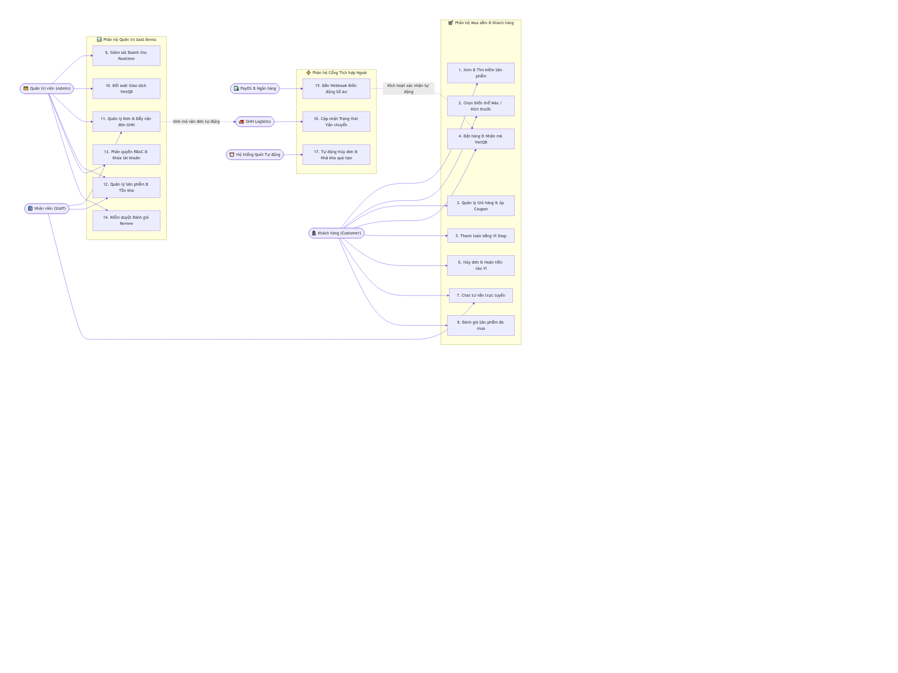

#### Mã nguồn Mermaid:
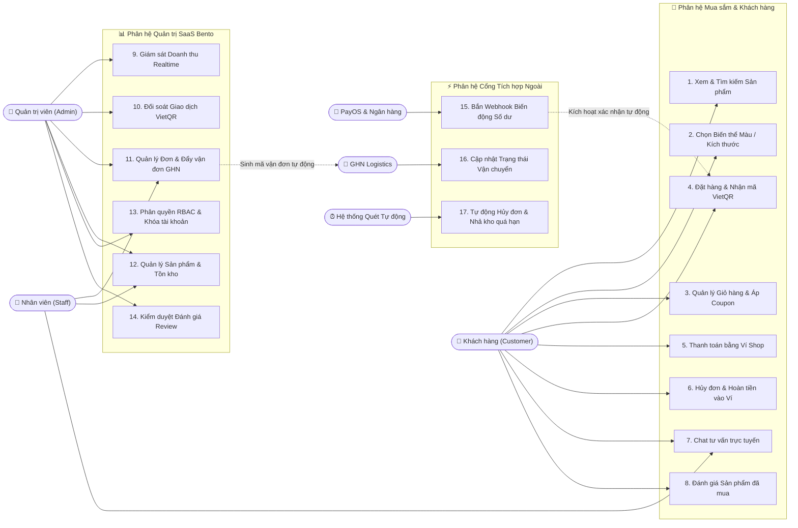
```mermaid
flowchart LR
    %% Actors
    Customer(["👤 Khách hàng (Customer)"])
    Admin(["👑 Quản trị viên (Admin)"])
    Staff(["👔 Nhân viên (Staff)"])
    PayOS_Bank(["🏦 PayOS & Ngân hàng"])
    GHN(["🚚 GHN Logistics"])
    SystemCron(["⏰ Hệ thống Quét Tự động"])

    %% Storefront Subsystem
    subgraph Storefront ["🛒 Phân hệ Mua sắm & Khách hàng"]
        UC1[1. Xem & Tìm kiếm Sản phẩm]
        UC2[2. Chọn Biến thể Màu / Kích thước]
        UC3[3. Quản lý Giỏ hàng & Áp Coupon]
        UC4[4. Đặt hàng & Nhận mã VietQR]
        UC5[5. Thanh toán bằng Ví Shop]
        UC6[6. Hủy đơn & Hoàn tiền vào Ví]
        UC7[7. Chat tư vấn trực tuyến]
        UC8[8. Đánh giá Sản phẩm đã mua]
    end

    %% Admin Subsystem
    subgraph AdminPortal ["📊 Phân hệ Quản trị SaaS Bento"]
        UC9[9. Giám sát Doanh thu Realtime]
        UC10[10. Đối soát Giao dịch VietQR]
        UC11[11. Quản lý Đơn & Đẩy vận đơn GHN]
        UC12[12. Quản lý Sản phẩm & Tồn kho]
        UC13[13. Phân quyền RBAC & Khóa tài khoản]
        UC14[14. Kiểm duyệt Đánh giá Review]
    end

    %% Background & Gateways
    subgraph Gateways ["⚡ Phân hệ Cổng Tích hợp Ngoài"]
        UC15[15. Bắn Webhook Biến động Số dư]
        UC16[16. Cập nhật Trạng thái Vận chuyển]
        UC17[17. Tự động Hủy đơn & Nhả kho quá hạn]
    end

    %% Customer Connections
    Customer --> UC1
    Customer --> UC2
    Customer --> UC3
    Customer --> UC4
    Customer --> UC5
    Customer --> UC6
    Customer --> UC7
    Customer --> UC8

    %% Staff Connections
    Staff --> UC11
    Staff --> UC12
    Staff --> UC7

    %% Admin Connections
    Admin --> UC9
    Admin --> UC10
    Admin --> UC11
    Admin --> UC12
    Admin --> UC13
    Admin --> UC14

    %% Third-party System Connections
    PayOS_Bank --> UC15
    UC15 -.->|Kích hoạt xác nhận tự động| UC4
    GHN --> UC16
    UC11 -.->|Sinh mã vận đơn tự động| GHN
    SystemCron --> UC17
```

---

### UML 02: Sơ đồ Lớp Thực thể & Miền Nghiệp vụ (Class & Domain Model)

* **Phân loại UML:** `Class / Domain Diagram`
* **Mục đích:** Cấu trúc các thực thể dữ liệu Prisma, quan hệ thực thể (ERD) và các dịch vụ nghiệp vụ chính (Domain Services).
* **Đường dẫn Vector (SVG):** `docs/uml/images/02-class-domain.svg`
* **Đường dẫn Ảnh (PNG):** `docs/uml/images/02-class-domain.png`

#### Biểu diễn Trực quan:
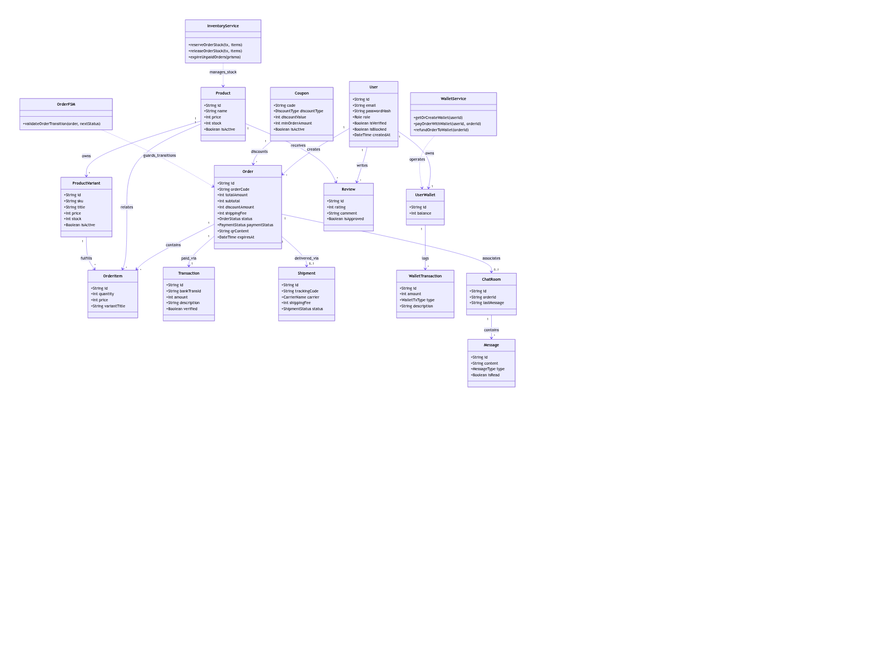

#### Mã nguồn Mermaid:
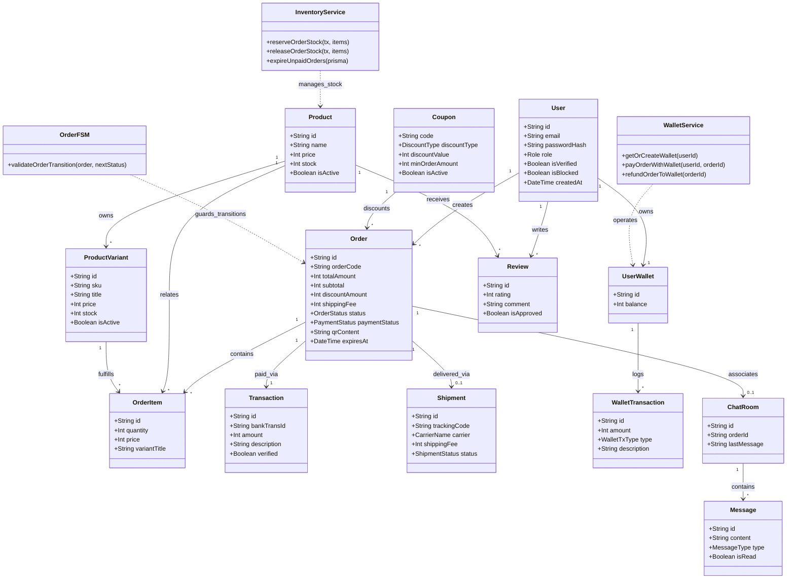
```mermaid
classDiagram
    direction TB

    class User {
        +String id
        +String email
        +String passwordHash
        +Role role
        +Boolean isVerified
        +Boolean isBlocked
        +DateTime createdAt
    }

    class Order {
        +String id
        +String orderCode
        +Int totalAmount
        +Int subtotal
        +Int discountAmount
        +Int shippingFee
        +OrderStatus status
        +PaymentStatus paymentStatus
        +String qrContent
        +DateTime expiresAt
    }

    class OrderItem {
        +String id
        +Int quantity
        +Int price
        +String variantTitle
    }

    class Product {
        +String id
        +String name
        +Int price
        +Int stock
        +Boolean isActive
    }

    class ProductVariant {
        +String id
        +String sku
        +String title
        +Int price
        +Int stock
        +Boolean isActive
    }

    class Transaction {
        +String id
        +String bankTransId
        +Int amount
        +String description
        +Boolean verified
    }

    class Shipment {
        +String id
        +String trackingCode
        +CarrierName carrier
        +Int shippingFee
        +ShipmentStatus status
    }

    class UserWallet {
        +String id
        +Int balance
    }

    class WalletTransaction {
        +String id
        +Int amount
        +WalletTxType type
        +String description
    }

    class Coupon {
        +String code
        +DiscountType discountType
        +Int discountValue
        +Int minOrderAmount
        +Boolean isActive
    }

    class Review {
        +String id
        +Int rating
        +String comment
        +Boolean isApproved
    }

    class ChatRoom {
        +String id
        +String orderId
        +String lastMessage
    }

    class Message {
        +String id
        +String content
        +MessageType type
        +Boolean isRead
    }

    %% Domain Service Classes
    class WalletService {
        +getOrCreateWallet(userId)
        +payOrderWithWallet(userId, orderId)
        +refundOrderToWallet(orderId)
    }

    class InventoryService {
        +reserveOrderStock(tx, items)
        +releaseOrderStock(tx, items)
        +expireUnpaidOrders(prisma)
    }

    class OrderFSM {
        +validateOrderTransition(order, nextStatus)
    }

    %% Relationships
    User "1" --> "*" Order : creates
    User "1" --> "1" UserWallet : owns
    UserWallet "1" --> "*" WalletTransaction : logs
    Order "1" --> "*" OrderItem : contains
    Product "1" --> "*" ProductVariant : owns
    Product "1" --> "*" OrderItem : relates
    ProductVariant "1" --> "*" OrderItem : fulfills
    Order "1" --> "1" Transaction : paid_via
    Order "1" --> "0..1" Shipment : delivered_via
    Coupon "1" --> "*" Order : discounts
    Order "1" --> "0..1" ChatRoom : associates
    ChatRoom "1" --> "*" Message : contains
    User "1" --> "*" Review : writes
    Product "1" --> "*" Review : receives
    WalletService ..> UserWallet : operates
    InventoryService ..> Product : manages_stock
    OrderFSM ..> Order : guards_transitions
```

---

### UML 03: Sơ đồ Tuần tự 1: Thanh toán VietQR & Đối soát Tự động

* **Phân loại UML:** `Sequence Diagram`
* **Mục đích:** Quy trình tạo đơn, quét mã VietQR ngân hàng, nhận Webhook an toàn, tự động khớp tiền và đẩy sang GHN.
* **Đường dẫn Vector (SVG):** `docs/uml/images/03-sequence-vietqr-payment.svg`
* **Đường dẫn Ảnh (PNG):** `docs/uml/images/03-sequence-vietqr-payment.png`

#### Biểu diễn Trực quan:
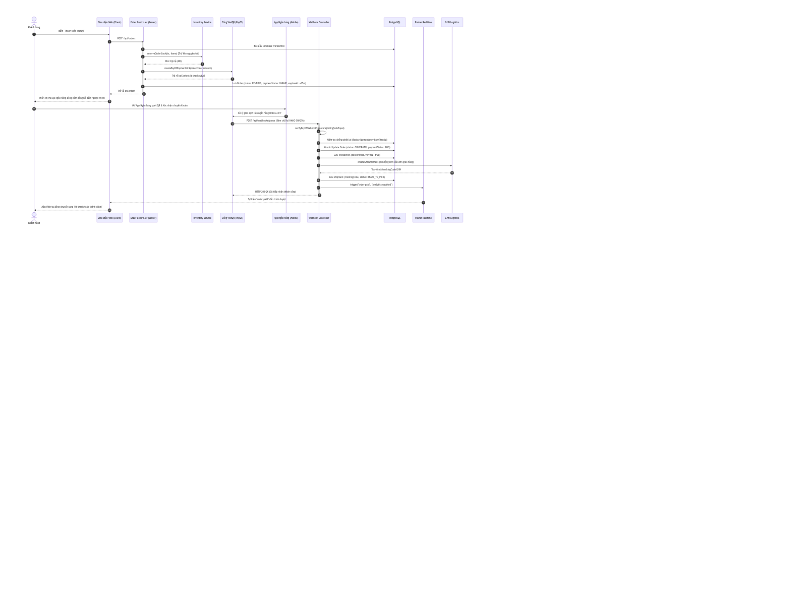

#### Mã nguồn Mermaid:
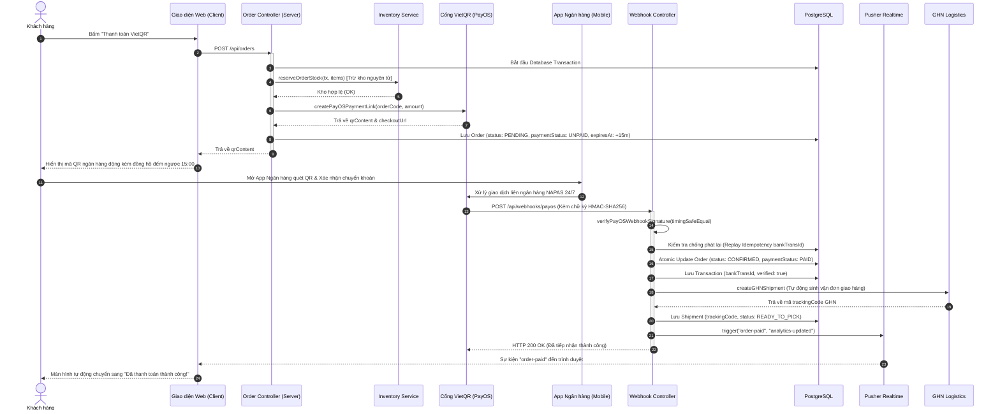
```mermaid
sequenceDiagram
    autonumber
    actor Customer as Khách hàng
    participant UI as Giao diện Web (Client)
    participant API as Order Controller (Server)
    participant Inv as Inventory Service
    participant PayOS as Cổng VietQR (PayOS)
    participant BankApp as App Ngân hàng (Mobile)
    participant Webhook as Webhook Controller
    participant DB as PostgreSQL
    participant Pusher as Pusher Realtime
    participant GHN as GHN Logistics

    Customer->>UI: Bấm "Thanh toán VietQR"
    UI->>API: POST /api/orders
    activate API
    API->>DB: Bắt đầu Database Transaction
    API->>Inv: reserveOrderStock(tx, items) [Trừ kho nguyên tử]
    Inv-->>API: Kho hợp lệ (OK)
    API->>PayOS: createPayOSPaymentLink(orderCode, amount)
    PayOS-->>API: Trả về qrContent & checkoutUrl
    API->>DB: Lưu Order (status: PENDING, paymentStatus: UNPAID, expiresAt: +15m)
    API-->>UI: Trả về qrContent
    deactivate API

    UI-->>Customer: Hiển thị mã QR ngân hàng động kèm đồng hồ đếm ngược 15:00
    Customer->>BankApp: Mở App Ngân hàng quét QR & Xác nhận chuyển khoản
    BankApp->>PayOS: Xử lý giao dịch liên ngân hàng NAPAS 24/7
    PayOS->>Webhook: POST /api/webhooks/payos (Kèm chữ ký HMAC-SHA256)
    
    activate Webhook
    Webhook->>Webhook: verifyPayOSWebhookSignature(timingSafeEqual)
    Webhook->>DB: Kiểm tra chống phát lại (Replay Idempotency bankTransId)
    Webhook->>DB: Atomic Update Order (status: CONFIRMED, paymentStatus: PAID)
    Webhook->>DB: Lưu Transaction (bankTransId, verified: true)
    Webhook->>GHN: createGHNShipment (Tự động sinh vận đơn giao hàng)
    GHN-->>Webhook: Trả về mã trackingCode GHN
    Webhook->>DB: Lưu Shipment (trackingCode, status: READY_TO_PICK)
    Webhook->>Pusher: trigger("order-paid", "analytics-updated")
    Webhook-->>PayOS: HTTP 200 OK (Đã tiếp nhận thành công)
    deactivate Webhook

    Pusher-->>UI: Sự kiện "order-paid" đến trình duyệt
    UI-->>Customer: Màn hình tự động chuyển sang "Đã thanh toán thành công!"
```

---

### UML 04: Sơ đồ Tuần tự 2: Hủy đơn & Hoàn tiền Ví CAS Nguyên tử

* **Phân loại UML:** `Sequence Diagram`
* **Mục đích:** Quy trình hủy đơn hàng đã thanh toán với cơ chế Atomic CAS chống Double-Refund và tự động hoàn kho.
* **Đường dẫn Vector (SVG):** `docs/uml/images/04-sequence-wallet-refund.svg`
* **Đường dẫn Ảnh (PNG):** `docs/uml/images/04-sequence-wallet-refund.png`

#### Biểu diễn Trực quan:
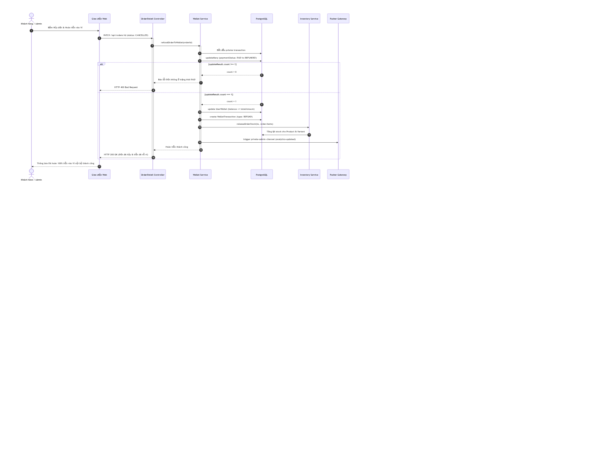

#### Mã nguồn Mermaid:
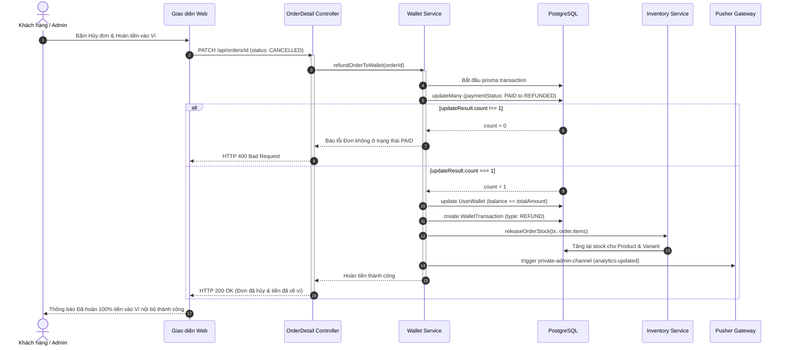
```mermaid
sequenceDiagram
    autonumber
    actor User as Khách hàng / Admin
    participant UI as Giao diện Web
    participant OrderCtrl as OrderDetail Controller
    participant WalletSvc as Wallet Service
    participant DB as PostgreSQL
    participant InvSvc as Inventory Service
    participant Pusher as Pusher Gateway

    User->>UI: Bấm Hủy đơn & Hoàn tiền vào Ví
    UI->>OrderCtrl: PATCH /api/orders/id (status: CANCELLED)
    activate OrderCtrl
    OrderCtrl->>WalletSvc: refundOrderToWallet(orderId)
    
    activate WalletSvc
    WalletSvc->>DB: Bắt đầu prisma transaction
    WalletSvc->>DB: updateMany (paymentStatus: PAID to REFUNDED)
    
    alt updateResult.count !== 1
        DB-->>WalletSvc: count = 0
        WalletSvc-->>OrderCtrl: Báo lỗi Đơn không ở trạng thái PAID
        OrderCtrl-->>UI: HTTP 400 Bad Request
    else updateResult.count === 1
        DB-->>WalletSvc: count = 1
        WalletSvc->>DB: update UserWallet (balance += totalAmount)
        WalletSvc->>DB: create WalletTransaction (type: REFUND)
        WalletSvc->>InvSvc: releaseOrderStock(tx, order.items)
        InvSvc->>DB: Tăng lại stock cho Product & Variant
        WalletSvc->>Pusher: trigger private-admin-channel (analytics-updated)
        WalletSvc-->>OrderCtrl: Hoàn tiền thành công
        deactivate WalletSvc
        OrderCtrl-->>UI: HTTP 200 OK (Đơn đã hủy & tiền đã về ví)
    end
    deactivate OrderCtrl

    UI-->>User: Thông báo Đã hoàn 100% tiền vào Ví nội bộ thành công
```

---

### UML 05: Sơ đồ Hoạt động 1: Quy trình Đặt hàng & Giữ kho Nguyên tử

* **Phân loại UML:** `Activity Diagram`
* **Mục đích:** Quy trình kiểm tra tính hợp lệ, trừ kho nguyên tử (Atomic Inventory Reservation) và phân luồng thanh toán.
* **Đường dẫn Vector (SVG):** `docs/uml/images/05-activity-order-placement.svg`
* **Đường dẫn Ảnh (PNG):** `docs/uml/images/05-activity-order-placement.png`

#### Biểu diễn Trực quan:
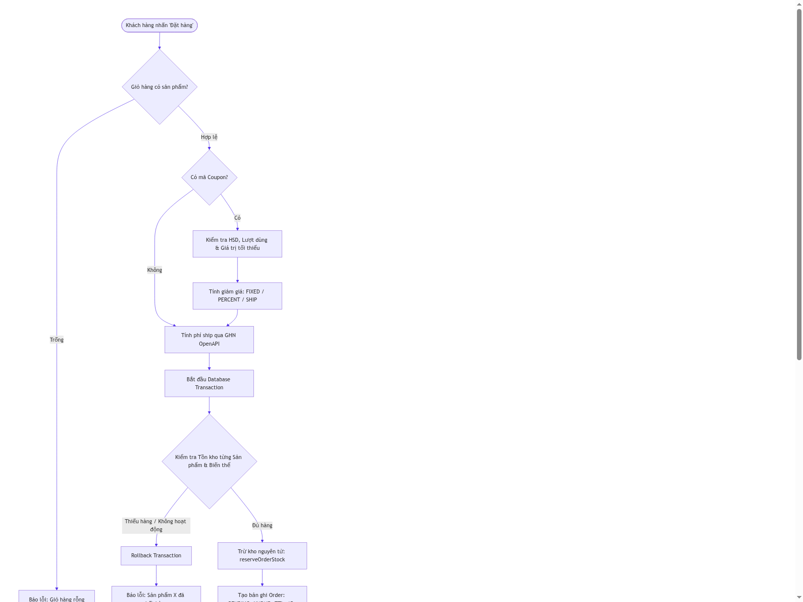

#### Mã nguồn Mermaid:
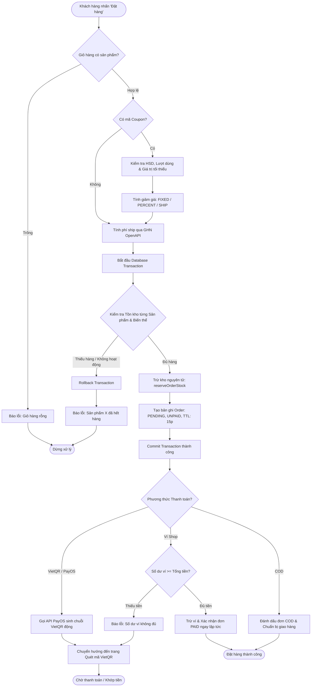
```mermaid
flowchart TD
    Start([Khách hàng nhấn 'Đặt hàng']) --> ValidateCart{Giỏ hàng có sản phẩm?}
    ValidateCart -- Trống --> ErrEmpty[Báo lỗi: Giỏ hàng rỗng] --> StopErr([Dừng xử lý])
    
    ValidateCart -- Hợp lệ --> CheckCoupon{Có mã Coupon?}
    CheckCoupon -- Có --> ValidateCoupon[Kiểm tra HSD, Lượt dùng & Giá trị tối thiểu]
    ValidateCoupon --> ApplyDiscount[Tính giảm giá: FIXED / PERCENT / SHIP]
    CheckCoupon -- Không --> CalcShipping[Tính phí ship qua GHN OpenAPI]
    ApplyDiscount --> CalcShipping

    CalcShipping --> BeginTx[Bắt đầu Database Transaction]
    BeginTx --> CheckStock{Kiểm tra Tồn kho từng Sản phẩm & Biến thể}
    
    CheckStock -- Thiếu hàng / Không hoạt động --> RollbackTx[Rollback Transaction]
    RollbackTx --> ErrStock[Báo lỗi: Sản phẩm X đã hết hàng] --> StopErr

    CheckStock -- Đủ hàng --> ReserveStock[Trừ kho nguyên tử: reserveOrderStock]
    ReserveStock --> CreateOrder[Tạo bản ghi Order: PENDING, UNPAID, TTL: 15p]
    CreateOrder --> CommitTx[Commit Transaction thành công]

    CommitTx --> ChoosePayment{Phương thức Thanh toán?}
    
    ChoosePayment -- VietQR / PayOS --> GenQR[Gọi API PayOS sinh chuỗi VietQR động]
    GenQR --> ShowPaymentPage[Chuyển hướng đến trang Quét mã VietQR]
    
    ChoosePayment -- Ví Shop --> CheckBalance{Số dư ví >= Tổng tiền?}
    CheckBalance -- Thiếu tiền --> ErrWallet[Báo lỗi: Số dư ví không đủ] --> ShowPaymentPage
    CheckBalance -- Đủ tiền --> DeductWallet[Trừ ví & Xác nhận đơn PAID ngay lập tức]
    
    ChoosePayment -- COD --> MarkCOD[Đánh dấu đơn COD & Chuẩn bị giao hàng]

    ShowPaymentPage --> EndOrder([Chờ thanh toán / Khớp tiền])
    DeductWallet --> EndSuccess([Đặt hàng thành công])
    MarkCOD --> EndSuccess
```

---

### UML 06: Sơ đồ Hoạt động 2: Bộ lọc An ninh & Đối soát Webhook Ngân hàng

* **Phân loại UML:** `Activity Diagram`
* **Mục đích:** Quy trình xử lý bất biến an toàn (Fail-Closed, Timing-Safe HMAC, Idempotency) khi tiếp nhận dữ liệu ngân hàng.
* **Đường dẫn Vector (SVG):** `docs/uml/images/06-activity-webhook-security.svg`
* **Đường dẫn Ảnh (PNG):** `docs/uml/images/06-activity-webhook-security.png`

#### Biểu diễn Trực quan:
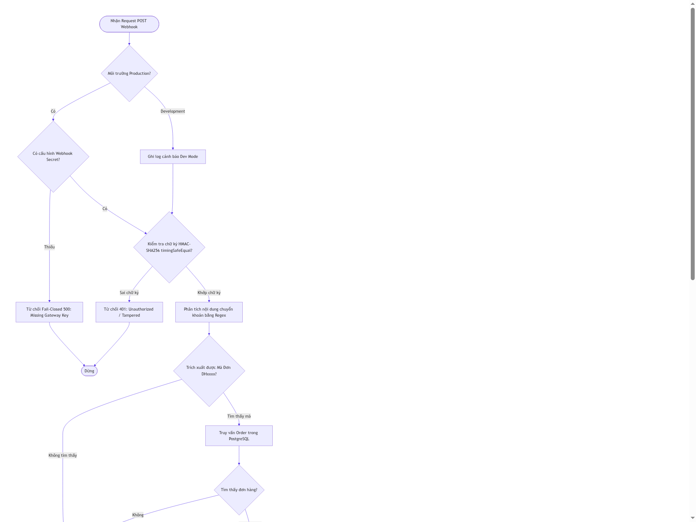

#### Mã nguồn Mermaid:
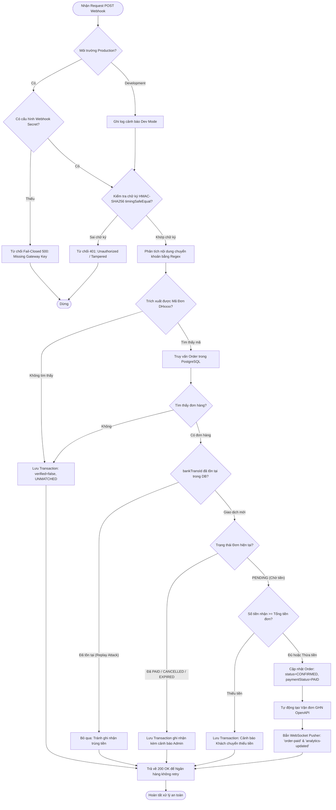
```mermaid
flowchart TD
    Start([Nhận Request POST Webhook]) --> CheckEnv{Môi trường Production?}
    
    CheckEnv -- Có --> CheckSecretConfig{Có cấu hình Webhook Secret?}
    CheckSecretConfig -- Thiếu --> FailClosed500[Từ chối Fail-Closed 500: Missing Gateway Key] --> StopErr([Dừng])
    CheckSecretConfig -- Có --> VerifySignature
    
    CheckEnv -- Development --> DevWarning[Ghi log cảnh báo Dev Mode] --> VerifySignature

    VerifySignature{Kiểm tra chữ ký HMAC-SHA256 timingSafeEqual?}
    VerifySignature -- Sai chữ ký --> Reject401[Từ chối 401: Unauthorized / Tampered] --> StopErr
    
    VerifySignature -- Khớp chữ ký --> ParseDesc[Phân tích nội dung chuyển khoản bằng Regex]
    ParseDesc --> FindOrderCode{Trích xuất được Mã Đơn DHxxxx?}
    FindOrderCode -- Không tìm thấy --> LogUnmatched[Lưu Transaction: verified=false, UNMATCHED] --> Resp200[Trả về 200 OK để Ngân hàng không retry]
    
    FindOrderCode -- Tìm thấy mã --> QueryDB[Truy vấn Order trong PostgreSQL]
    QueryDB --> OrderExists{Tìm thấy đơn hàng?}
    OrderExists -- Không --> LogUnmatched
    
    OrderExists -- Có đơn hàng --> CheckIdempotency{bankTransId đã tồn tại trong DB?}
    CheckIdempotency -- Đã tồn tại (Replay Attack) --> SkipDuplicate[Bỏ qua: Tránh ghi nhận trùng tiền] --> Resp200
    
    CheckIdempotency -- Giao dịch mới --> CheckOrderStatus{Trạng thái Đơn hiện tại?}
    CheckOrderStatus -- Đã PAID / CANCELLED / EXPIRED --> LogLateTx[Lưu Transaction ghi nhận kèm cảnh báo Admin] --> Resp200
    
    CheckOrderStatus -- PENDING (Chờ tiền) --> CompareAmount{Số tiền nhận >= Tổng tiền đơn?}
    CompareAmount -- Thiếu tiền --> UnderpaidAlert[Lưu Transaction: Cảnh báo Khách chuyển thiếu tiền] --> Resp200
    
    CompareAmount -- Đủ hoặc Thừa tiền --> AtomicUpdate[Cập nhật Order: status=CONFIRMED, paymentStatus=PAID]
    AtomicUpdate --> PushGHN[Tự động tạo Vận đơn GHN OpenAPI]
    PushGHN --> BroadcastRealtime[Bắn WebSocket Pusher: 'order-paid' & 'analytics-updated']
    BroadcastRealtime --> Resp200 --> EndDone([Hoàn tất xử lý an toàn])
```

---

### UML 07: Sơ đồ Máy trạng thái: Vòng đời Đơn hàng & Thanh toán (FSM)

* **Phân loại UML:** `State Machine Diagram`
* **Mục đích:** Cỗ máy hữu hạn trạng thái (Finite State Machine) quản lý tính nhất quán của Đơn hàng và Kho hàng.
* **Đường dẫn Vector (SVG):** `docs/uml/images/07-state-machine-orders.svg`
* **Đường dẫn Ảnh (PNG):** `docs/uml/images/07-state-machine-orders.png`

#### Biểu diễn Trực quan:
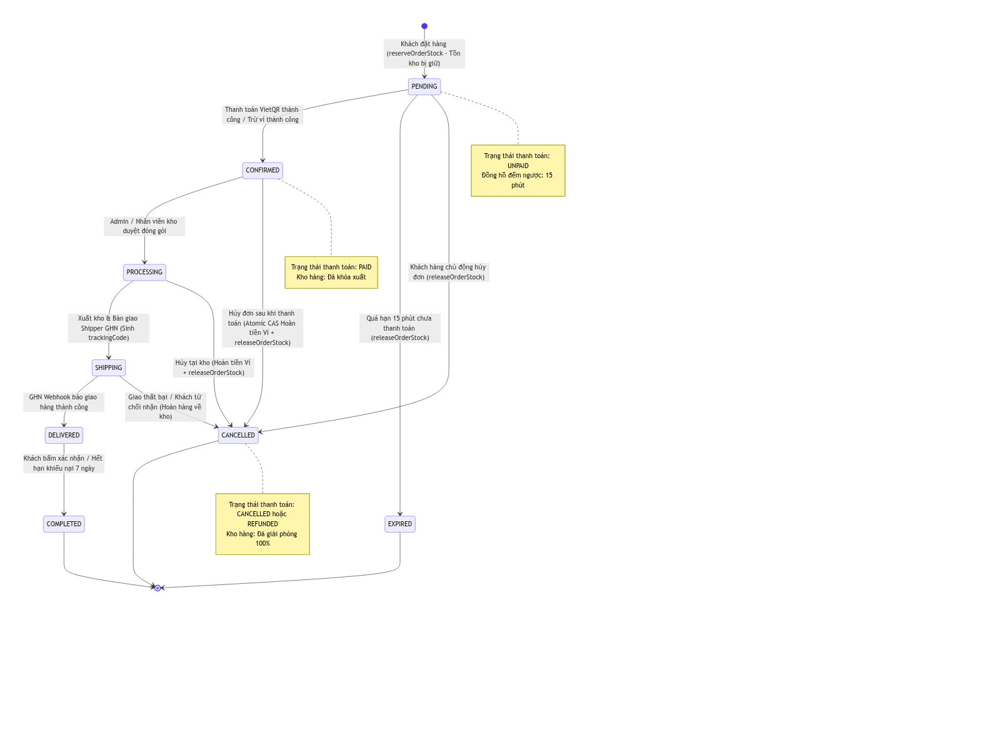

#### Mã nguồn Mermaid:
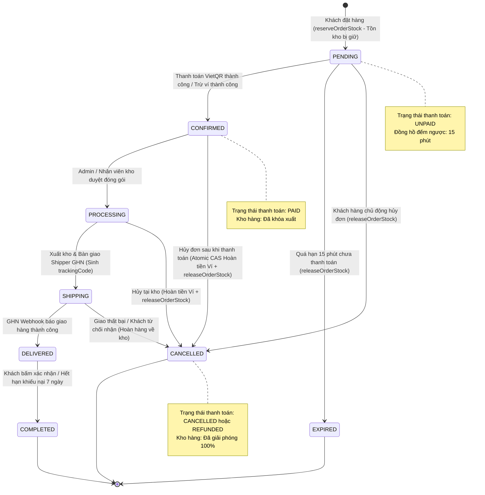
```mermaid
stateDiagram-v2
    direction TB

    [*] --> PENDING: Khách đặt hàng (reserveOrderStock - Tồn kho bị giữ)

    PENDING --> CONFIRMED: Thanh toán VietQR thành công / Trừ ví thành công
    PENDING --> EXPIRED: Quá hạn 15 phút chưa thanh toán (releaseOrderStock)
    PENDING --> CANCELLED: Khách hàng chủ động hủy đơn (releaseOrderStock)

    CONFIRMED --> PROCESSING: Admin / Nhân viên kho duyệt đóng gói
    CONFIRMED --> CANCELLED: Hủy đơn sau khi thanh toán (Atomic CAS Hoàn tiền Ví + releaseOrderStock)

    PROCESSING --> SHIPPING: Xuất kho & Bàn giao Shipper GHN (Sinh trackingCode)
    PROCESSING --> CANCELLED: Hủy tại kho (Hoàn tiền Ví + releaseOrderStock)

    SHIPPING --> DELIVERED: GHN Webhook báo giao hàng thành công
    SHIPPING --> CANCELLED: Giao thất bại / Khách từ chối nhận (Hoàn hàng về kho)

    DELIVERED --> COMPLETED: Khách bấm xác nhận / Hết hạn khiếu nại 7 ngày

    EXPIRED --> [*]
    CANCELLED --> [*]
    COMPLETED --> [*]

    note right of PENDING
        Trạng thái thanh toán: UNPAID
        Đồng hồ đếm ngược: 15 phút
    end note

    note right of CONFIRMED
        Trạng thái thanh toán: PAID
        Kho hàng: Đã khóa xuất
    end note

    note right of CANCELLED
        Trạng thái thanh toán: CANCELLED hoặc REFUNDED
        Kho hàng: Đã giải phóng 100%
    end note
```

---

### UML 08: Sơ đồ Thành phần Kiến trúc Phần mềm (Clean Architecture)

* **Phân loại UML:** `Component Diagram`
* **Mục đích:** Mô hình phân tầng kiến trúc nghiêm ngặt (@client, @server, @shared) bảo đảm Zero-Server-Leakage.
* **Đường dẫn Vector (SVG):** `docs/uml/images/08-component-clean-architecture.svg`
* **Đường dẫn Ảnh (PNG):** `docs/uml/images/08-component-clean-architecture.png`

#### Biểu diễn Trực quan:
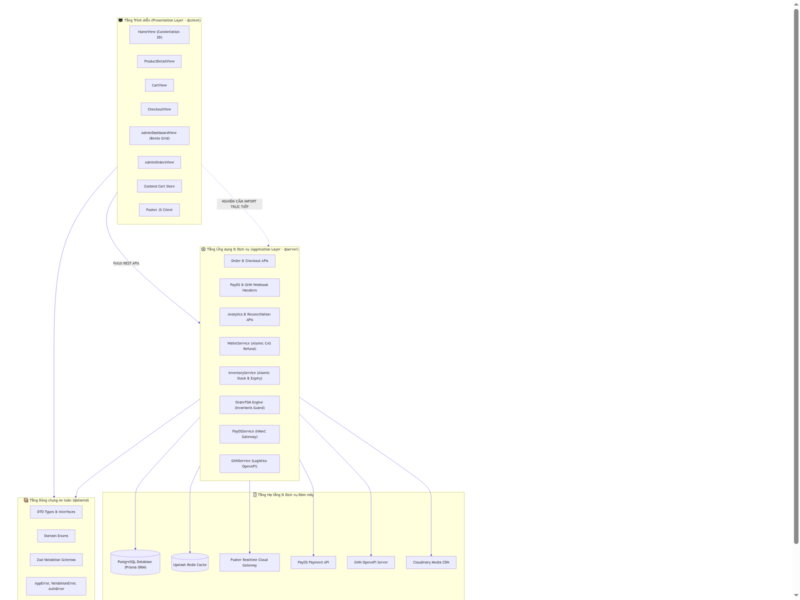

#### Mã nguồn Mermaid:
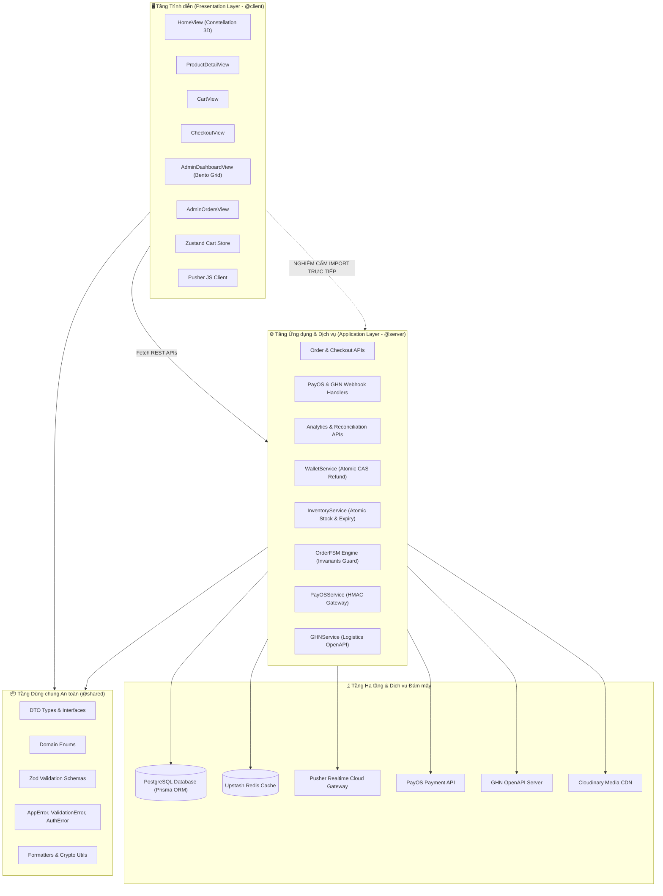
```mermaid
flowchart TB
    subgraph PresentationLayer ["🖥️ Tầng Trình diễn (Presentation Layer - @client)"]
        HomeView["HomeView (Constellation 3D)"]
        ProductDetailView["ProductDetailView"]
        CartView["CartView"]
        CheckoutView["CheckoutView"]
        AdminDashboard["AdminDashboardView (Bento Grid)"]
        AdminOrders["AdminOrdersView"]
        ZustandCart["Zustand Cart Store"]
        PusherClient["Pusher JS Client"]
    end

    subgraph ApplicationLayer ["⚙️ Tầng Ứng dụng & Dịch vụ (Application Layer - @server)"]
        OrderRoutes["Order & Checkout APIs"]
        WebhookRoutes["PayOS & GHN Webhook Handlers"]
        AdminRoutes["Analytics & Reconciliation APIs"]
        WalletService["WalletService (Atomic CAS Refund)"]
        InventoryService["InventoryService (Atomic Stock & Expiry)"]
        OrderFSM["OrderFSM Engine (Invariants Guard)"]
        PayOSService["PayOSService (HMAC Gateway)"]
        GHNService["GHNService (Logistics OpenAPI)"]
    end

    subgraph SharedLayer ["📦 Tầng Dùng chung An toàn (@shared)"]
        SharedTypes["DTO Types & Interfaces"]
        SharedEnums["Domain Enums"]
        SharedValidators["Zod Validation Schemas"]
        SharedErrors["AppError, ValidationError, AuthError"]
        SharedUtils["Formatters & Crypto Utils"]
    end

    subgraph InfrastructureLayer ["🗄️ Tầng Hạ tầng & Dịch vụ Đám mây"]
        PostgresDB[("PostgreSQL Database (Prisma ORM)")]
        RedisCache[("Upstash Redis Cache")]
        PusherCloud["Pusher Realtime Cloud Gateway"]
        PayOSGateway["PayOS Payment API"]
        GHNCloud["GHN OpenAPI Server"]
        CloudinaryCDN["Cloudinary Media CDN"]
    end

    PresentationLayer --> SharedLayer
    ApplicationLayer --> SharedLayer
    PresentationLayer -->|Fetch REST APIs| ApplicationLayer
    PresentationLayer -.->|NGHIÊM CẤM IMPORT TRỰC TIẾP| ApplicationLayer

    ApplicationLayer --> PostgresDB
    ApplicationLayer --> RedisCache
    ApplicationLayer --> PusherCloud
    ApplicationLayer --> PayOSGateway
    ApplicationLayer --> GHNCloud
    ApplicationLayer --> CloudinaryCDN
```

---

### UML 09: Sơ đồ Triển khai Hạ tầng Hệ thống (Deployment Architecture)

* **Phân loại UML:** `Deployment Diagram`
* **Mục đích:** Kiến trúc triển khai phân tán trên nền tảng Serverless, Managed Database và các Micro-SaaS API.
* **Đường dẫn Vector (SVG):** `docs/uml/images/09-deployment-infrastructure.svg`
* **Đường dẫn Ảnh (PNG):** `docs/uml/images/09-deployment-infrastructure.png`

#### Biểu diễn Trực quan:
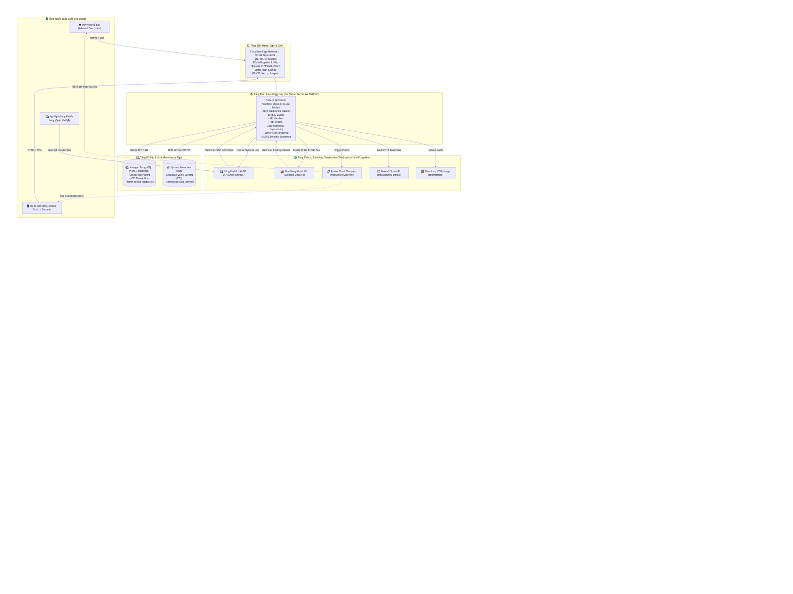

#### Mã nguồn Mermaid:
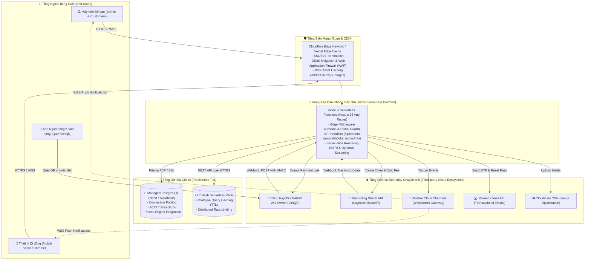
```mermaid
flowchart TB
    %% Client Devices
    subgraph ClientTier ["📱 Tầng Người dùng Cuối (End Users)"]
        DesktopBrowser["💻 Máy tính Để bàn (Admin & Customers)"]
        MobileBrowser["📱 Thiết bị Di động (Mobile Safari / Chrome)"]
        BankAppDevice["🏦 App Ngân hàng Khách hàng (Quét VietQR)"]
    end

    %% Edge & Network
    subgraph EdgeTier ["🛡️ Tầng Biên Mạng (Edge & CDN)"]
        CloudflareEdge["Cloudflare Edge Network / Vercel Edge Cache
- SSL/TLS Termination
- DDoS Mitigation & Web Application Firewall (WAF)
- Static Asset Caching (JS/CSS/Next.js Images)"]
    end

    %% Compute Tier
    subgraph ComputeTier ["⚡ Tầng Điện toán Không máy chủ (Vercel Serverless Platform)"]
        NodeRuntime["Node.js Serverless Functions (Next.js 16 App Router)
- Edge Middleware (Session & RBAC Guard)
- API Handlers (/api/orders, /api/webhooks, /api/admin)
- Server-Side Rendering (SSR) & Dynamic Streaming"]
    end

    %% Persistence Tier
    subgraph PersistenceTier ["💾 Tầng Dữ liệu Cốt lõi (Persistence Tier)"]
        PostgresInstance[("🐘 Managed PostgreSQL (Neon / Supabase)
- Connection Pooling
- ACID Transactions
- Prisma Engine Integration")]
        RedisInstance[("⚡ Upstash Serverless Redis
- Catalogue Query Caching (TTL)
- Distributed Rate Limiting")]
    end

    %% External SaaS Ecosystem
    subgraph ExternalSaaSTier ["🌐 Tầng Dịch vụ Đám mây Chuyên biệt (Third-party Cloud Ecosystem)"]
        PayOSServer["🏦 Cổng PayOS / NAPAS 247 Switch (VietQR)"]
        GHNServer["🚚 Giao Hàng Nhanh API (Logistics OpenAPI)"]
        PusherServer["📡 Pusher Cloud Channels (WebSocket Gateway)"]
        ResendServer["✉️ Resend Cloud API (Transactional Emails)"]
        CloudinaryServer["🖼️ Cloudinary CDN (Image Optimization)"]
    end

    %% Connections
    DesktopBrowser -->|HTTPS / WSS| CloudflareEdge
    MobileBrowser -->|HTTPS / WSS| CloudflareEdge
    BankAppDevice -->|Quét QR chuyển tiền| PayOSServer

    CloudflareEdge --> NodeRuntime
    NodeRuntime -->|Prisma TCP / SSL| PostgresInstance
    NodeRuntime -->|REST API over HTTPS| RedisInstance
    NodeRuntime -->|Trigger Events| PusherServer
    PusherServer -.->|WSS Push Notifications| DesktopBrowser
    PusherServer -.->|WSS Push Notifications| MobileBrowser

    NodeRuntime -->|Create Payment Link| PayOSServer
    PayOSServer -->|Webhook POST with HMAC| NodeRuntime

    NodeRuntime -->|Create Order & Calc Fee| GHNServer
    GHNServer -->|Webhook Tracking Update| NodeRuntime

    NodeRuntime -->|Send OTP & Reset Pass| ResendServer
    NodeRuntime -->|Upload Media| CloudinaryServer
```

---

### UML 10: Sơ đồ Gói & Cấu trúc Mô-đun (Package Diagram)

* **Phân loại UML:** `Package Diagram`
* **Mục đích:** Cấu trúc các gói mã nguồn, quy ước phân vùng trách nhiệm và ranh giới mô-đun trong dự án.
* **Đường dẫn Vector (SVG):** `docs/uml/images/10-package-modularity.svg`
* **Đường dẫn Ảnh (PNG):** `docs/uml/images/10-package-modularity.png`

#### Biểu diễn Trực quan:
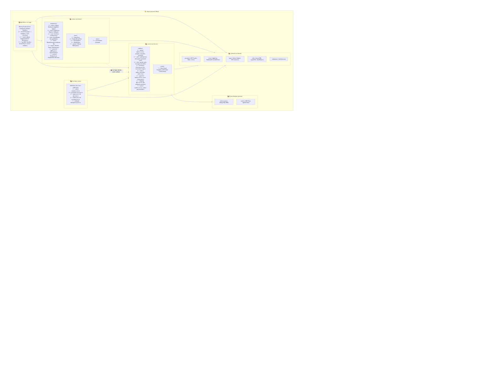

#### Mã nguồn Mermaid:
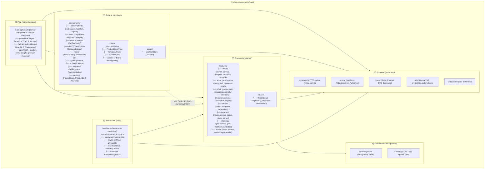
```mermaid
flowchart TB
    %% Root Packages
    subgraph RootProject ["📁 shop-qr-payment (Root)"]
        
        subgraph PkgClient ["📦 @client (src/client)"]
            direction TB
            ClientComponents["components/
├── admin/ (Bento Dashboard, AppShell, Topbar)
├── auth/ (LoginForm, Register, OtpInput)
├── cart/ (CartItem, CartSummary)
├── chat/ (ChatWindow, MessageBubble)
├── home/ (HeroFloatingConstellation 3D)
├── layout/ (Header, Footer, Notifications)
├── payment/ (QRPayment, PaymentStatus)
└── product/ (ProductCard, ProductGrid, Reviews)"]
            ClientViews["views/
├── HomeView
├── ProductDetailView
├── CheckoutView
├── WishlistView
└── admin/ (7 Bento Workspaces)"]
            ClientStores["stores/
└── useCartStore (Zustand)"]
        end

        subgraph PkgServer ["📦 @server (src/server)"]
            direction TB
            ServerModules["modules/
├── admin/ (admin.service, analytics.controller, reconcile)
├── auth/ (auth-options, rbac-guard, password-reset)
├── chat/ (pusher-auth, messages.controller)
├── inventory/ (inventory.service, reservation-engine)
├── orders/ (orders.controller, orders.fsm)
├── payment/ (payos.service, casso, vietqr-parser)
├── shipping/ (ghn.service, ghn-webhook.controller)
└── wallet/ (wallet.service, wallet-pay.controller)"]
            ServerEmails["emails/
└── React Email Templates (OTP, Order Confirmation)"]
        end

        subgraph PkgShared ["📦 @shared (src/shared)"]
            direction TB
            SharedConst["constants/ (HTTP codes, Roles, Limits)"]
            SharedErrors["errors/ (AppError, ValidationError, AuthError)"]
            SharedTypes["types/ (Order, Product, DTO Contracts)"]
            SharedUtils["utils/ (formatVND, cryptoUtils, dateHelpers)"]
            SharedVal["validations/ (Zod Schemas)"]
        end

        subgraph PkgApp ["📦 App Router (src/app)"]
            AppPages["Routing Facade (Server Components & Route Handlers)
├── (storefront pages: /, /products, /cart, /checkout)
├── /admin (Admin Layout Guard & 7 Workspaces)
└── /api (REST Handlers forwarding to @server modules)"]
        end

        subgraph PkgPrisma ["📦 Prisma Database (prisma)"]
            PrismaSchema["schema.prisma (PostgreSQL ORM)"]
            PrismaSeed["seed.ts (100% Thực nghiệm Data)"]
        end

        subgraph PkgTests ["📦 Test Suites (tests)"]
            TestFiles["240 Native Test Cases (node:test)
├── admin-analytics.test.ts
├── password-reset.test.ts
├── payos.test.ts & ghn.test.ts
├── wallet.test.ts & inventory.test.ts
└── webhook-idempotency.test.ts"]
        end
    end

    %% Dependency Arrows
    PkgApp --> PkgClient
    PkgApp --> PkgServer
    PkgApp --> PkgShared

    PkgClient --> PkgShared
    PkgServer --> PkgShared
    PkgServer --> PkgPrisma

    %% Zero Server Leakage Rule
    PkgClient -.->|❌ BỊ CHẶN: KHÔNG ĐƯỢC IMPORT| PkgServer

    PkgTests --> PkgServer
    PkgTests --> PkgShared
```

---
