# BỘ 13 SƠ ĐỒ UML KIẾN TRÚC TOÀN DIỆN — DỰ ÁN SHOP-QR-PAYMENT (SHOP.)

> **Tài liệu đặc tả kiến trúc kỹ thuật chuẩn UML 2.5**  
> **Hệ thống:** Website Thương mại điện tử Bán lẻ Tích hợp Thanh toán VietQR Tự động & Quản trị SaaS Bento Grid  
> **Chỉ huy kiến trúc:** Tech Lead & System Architect  
> **Công nghệ cốt lõi:** Next.js 16 App Router, PostgreSQL (Prisma ORM), Upstash Redis, Pusher WebSockets, PayOS VietQR, Giao Hàng Nhanh (GHN) OpenAPI.

---

## 📌 MỤC LỤC 13 BẢNG SƠ ĐỒ UML

### 1. Nhóm Sơ đồ Hành vi & Luồng Tương tác (Behavioral & Interaction Diagrams)
1. [UML 01: Sơ đồ Ca sử dụng (Use Case Diagram)](#uml-01-sơ-đồ-ca-sử-dụng-use-case-diagram)
2. [UML 03: Sơ đồ Tuần tự 1 - Đặt hàng & Thanh toán VietQR](#uml-03-sơ-đồ-tuần-tự-1-đặt-hàng--thanh-toán-vietqr)
3. [UML 04: Sơ đồ Tuần tự 2 - Nạp tiền Ví nội bộ qua VietQR](#uml-04-sơ-đồ-tuần-tự-2-nạp-tiền-ví-nội-bộ-qua-vietqr)
4. [UML 05: Sơ đồ Tuần tự 3 - Hủy đơn & Hoàn tiền Ví CAS Nguyên tử](#uml-05-sơ-đồ-tuần-tự-3-hủy-đơn--hoàn-tiền-ví-cas-nguyên-tử)
5. [UML 06: Sơ đồ Tuần tự 4 - Chat Tư vấn Trực tuyến Real-time](#uml-06-sơ-đồ-tuần-tự-4-chat-tư-vấn-trực-tuyến-real-time)
6. [UML 07: Sơ đồ Hoạt động 1 - Quy trình Đặt hàng & Giữ kho Nguyên tử](#uml-07-sơ-đồ-hoạt-động-1-quy-trình-đặt-hàng--giữ-kho-nguyên-tử)
7. [UML 08: Sơ đồ Hoạt động 2 - Bộ lọc An ninh & Đối soát Webhook Ngân hàng](#uml-08-sơ-đồ-hoạt-động-2-bộ-lọc-an-ninh--đối-soát-webhook-ngân-hàng)
8. [UML 09: Sơ đồ Máy trạng thái 1 - Vòng đời Đơn hàng & Quản lý Kho hàng (Order FSM)](#uml-09-sơ-đồ-máy-trạng-thái-1-vòng-đời-đơn-hàng--quản-lý-kho-hàng)
9. [UML 10: Sơ đồ Máy trạng thái 2 - Vòng đời Vận đơn Giao Hàng Nhanh (Logistics FSM)](#uml-10-sơ-đồ-máy-trạng-thái-2-vòng-đời-vận-đơn-giao-hàng-nhanh)

### 2. Nhóm Sơ đồ Cấu trúc & Phân tầng Phần mềm (Structural & Architectural Diagrams)
10. [UML 02: Sơ đồ Lớp Thực thể & Miền Nghiệp vụ (Class & Domain Model)](#uml-02-sơ-đồ-lớp-thực-thể--miền-nghiệp-vụ-class--domain-model)
11. [UML 11: Sơ đồ Thành phần Kiến trúc Phần mềm (Clean Architecture)](#uml-11-sơ-đồ-thành-phần-kiến-trúc-phần-mềm-clean-architecture)
12. [UML 12: Sơ đồ Triển khai Hạ tầng Hệ thống (Deployment Architecture)](#uml-12-sơ-đồ-triển-khai-hạ-tầng-hệ-thống-deployment-architecture)
13. [UML 13: Sơ đồ Gói & Cấu trúc Mô-đun (Package Diagram)](#uml-13-sơ-đồ-gói--cấu-trúc-mô-đun-package-diagram)

---

## 🏛️ NGUYÊN TẮC BẤT BIẾN KIẾN TRÚC (ARCHITECTURAL INVARIANTS)

Trước khi đi vào chi tiết từng sơ đồ, toàn bộ kỹ sư phát triển hệ thống phải tuân thủ 5 nguyên lý bất biến:
1. **Zero-Server-Leakage:** Mã nguồn client (`@client`) tuyệt đối không bao giờ được phép trực tiếp import các module server (`@server`). Toàn bộ giao tiếp bắt buộc thông qua HTTP REST API với các DTO và Zod Schema xác thực tại `@shared`.
2. **Atomic Inventory Reservation:** Việc giữ tồn kho khi tạo đơn (`reserveOrderStock`) và nhả tồn kho khi hủy đơn (`releaseOrderStock`) bắt buộc phải chạy trong cùng Database Transaction (`prisma.$transaction`) với trạng thái đơn hàng. Không bao giờ cho phép trừ kho ngoài transaction để chống race condition và overselling.
3. **Fail-Closed Webhook Security:** Webhook ngân hàng và cổng thanh toán luôn ở chế độ Fail-Closed: nếu thiếu Webhook Secret trong môi trường Production, hệ thống từ chối lập tức với mã 500. Xác thực chữ ký số bắt buộc dùng `crypto.timingSafeEqual` để loại trừ tấn công vét cạn thời gian (Timing Attack).
4. **Idempotency & Replay Attack Defense:** Mọi giao dịch ngân hàng đều được định danh qua `bankTransId`. Trước khi cộng tiền hoặc xác nhận đơn hàng, hệ thống bắt buộc kiểm tra xem giao dịch đã xử lý hay chưa để triệt tiêu lỗi cộng tiền trùng lặp khi cổng gửi lại webhook nhiều lần.
5. **Compare-And-Swap (CAS) Atomic Wallet:** Việc hoàn tiền đơn hàng vào ví nội bộ sử dụng kỹ thuật nguyên tử có điều kiện: `updateMany(where: {id, paymentStatus: 'PAID'}, data: {paymentStatus: 'REFUNDED'})`. Nếu `count !== 1`, hệ thống abort ngay lập tức để ngăn ngừa lỗi double-refund.

---

### UML 01: Sơ đồ Ca sử dụng (Use Case Diagram)

* **Phân loại UML:** `Use Case Diagram` (Hành vi)
* **Mục đích:** Mô tả tổng quan các tác nhân (Actors) và các trường hợp sử dụng (Use Cases) trong toàn bộ hệ thống shop-qr-payment.
* **Cơ chế kỹ thuật:** Phân tách ranh giới rõ ràng giữa Khách hàng (Storefront), Nhân viên & Quản trị viên (Admin SaaS Bento) và các Dịch vụ Nền / Cổng Tích hợp Ngoài (PayOS, GHN, Cron).

#### Mã nguồn Mermaid:
```mermaid
flowchart LR
    %% Actors
    Customer(["👤 Khách hàng (Customer)"])
    Staff(["👔 Nhân viên (Staff)"])
    Admin(["👑 Quản trị viên (Admin)"])
    PayOS_Bank(["🏦 PayOS & Ngân hàng (NAPAS 247)"])
    GHN(["🚚 GHN Logistics"])
    SystemCron(["⏰ Hệ thống Quét Tự động"])

    %% Storefront Subsystem
    subgraph Storefront ["🛒 Phân hệ Mua sắm & Khách hàng"]
        UC1[1. Xem & Tìm kiếm Sản phẩm]
        UC2[2. Chọn Biến thể Màu / Kích thước (SKU)]
        UC3[3. Quản lý Giỏ hàng & Áp Coupon]
        UC4[4. Đặt hàng & Nhận mã VietQR Động]
        UC5[5. Nạp tiền Ví nội bộ qua VietQR]
        UC6[6. Thanh toán Đơn bằng Ví Shop]
        UC7[7. Hủy đơn & Hoàn tiền vào Ví]
        UC8[8. Chat Tư vấn Trực tuyến Real-time]
        UC9[9. Đánh giá & Gửi nhận xét Sản phẩm]
        UC10[10. Quản lý Danh sách Yêu thích Wishlist]
    end

    %% Admin Subsystem
    subgraph AdminPortal ["📊 Phân hệ Quản trị SaaS Bento"]
        UC11[11. Giám sát Doanh thu Realtime]
        UC12[12. Đối soát Giao dịch VietQR]
        UC13[13. Quản lý Đơn & Đẩy vận đơn GHN]
        UC14[14. Quản lý Sản phẩm, Biến thể & Kho]
        UC15[15. Tư vấn Khách hàng qua Chat Room]
        UC16[16. Kiểm duyệt Đánh giá Review]
        UC17[17. Phân quyền RBAC & Khóa tài khoản]
    end

    %% Background & Gateways
    subgraph Gateways ["⚡ Phân hệ Cổng Tích hợp Ngoài"]
        UC18[18. Webhook Biến động Số dư (HMAC)]
        UC19[19. Webhook Trạng thái Vận đơn GHN]
        UC20[20. Tự động Hủy đơn & Nhả kho quá hạn]
    end

    %% Customer Connections
    Customer --> UC1
    Customer --> UC2
    Customer --> UC3
    Customer --> UC4
    Customer --> UC5
    Customer --> UC6
    Customer --> UC7
    Customer --> UC8
    Customer --> UC9
    Customer --> UC10

    %% Staff Connections
    Staff --> UC13
    Staff --> UC14
    Staff --> UC15

    %% Admin Connections
    Admin --> UC11
    Admin --> UC12
    Admin --> UC13
    Admin --> UC14
    Admin --> UC15
    Admin --> UC16
    Admin --> UC17

    %% External Systems Connections
    PayOS_Bank --> UC18
    UC18 -.->|Khớp tiền đơn hàng| UC4
    UC18 -.->|Khớp tiền nạp ví| UC5
    GHN --> UC19
    UC13 -.->|Sinh mã vận đơn tự động| GHN
    SystemCron --> UC20
```

---

### UML 02: Sơ đồ Lớp Thực thể & Miền Nghiệp vụ (Class & Domain Model)

* **Phân loại UML:** `Class Diagram` (Cấu trúc)
* **Mục đích:** Cấu trúc các thực thể dữ liệu Prisma, quan hệ thực thể (ERD) và các dịch vụ nghiệp vụ chính (Domain Services).
* **Cơ chế kỹ thuật:** Mô hình hóa toàn diện các thực thể quan hệ chặt chẽ: User, Order, Product, ProductVariant, Shipment, UserWallet, ChatRoom, Message, Review, Wishlist cùng các Domain Services chịu trách nhiệm thực thi các bất biến logic.

#### Mã nguồn Mermaid:
```mermaid
classDiagram
    direction TB

    class User {
        +String id
        +String email
        +String passwordHash
        +String name
        +String phone
        +Role role
        +Boolean isVerified
        +Boolean isBlocked
        +DateTime createdAt
    }

    class OtpCode {
        +String id
        +String email
        +String code
        +OtpType type
        +Boolean used
        +Int attempts
        +DateTime expiresAt
    }

    class Product {
        +String id
        +String name
        +String description
        +Int price
        +String category
        +Int stock
        +Boolean isActive
        +DateTime createdAt
    }

    class ProductVariant {
        +String id
        +String productId
        +String sku
        +String title
        +String color
        +String size
        +Int price
        +Int stock
        +Boolean isActive
    }

    class Order {
        +String id
        +String orderCode
        +String customerName
        +String customerPhone
        +String customerAddress
        +Int totalAmount
        +Int subtotal
        +Int discountAmount
        +Int shippingFee
        +OrderStatus status
        +PaymentStatus paymentStatus
        +String qrContent
        +DateTime expiresAt
    }

    class OrderItem {
        +String id
        +String orderId
        +String productId
        +String variantId
        +String variantTitle
        +Int quantity
        +Int price
    }

    class Coupon {
        +String code
        +DiscountType discountType
        +Int discountValue
        +Int minOrderAmount
        +Int usageLimit
        +Int usedCount
        +Boolean isActive
    }

    class CouponUsage {
        +String id
        +String couponId
        +String userId
        +String orderId
    }

    class Transaction {
        +String id
        +String orderId
        +String bankTransId
        +Int amount
        +String description
        +Boolean verified
        +DateTime receivedAt
    }

    class Shipment {
        +String id
        +String orderId
        +CarrierName carrier
        +String trackingCode
        +Int shippingFee
        +ShipmentStatus status
    }

    class UserWallet {
        +String id
        +String userId
        +Int balance
        +DateTime updatedAt
    }

    class WalletTransaction {
        +String id
        +String walletId
        +Int amount
        +WalletTxType type
        +String description
        +DateTime createdAt
    }

    class ChatRoom {
        +String id
        +String orderId
        +String lastMessage
        +DateTime lastActiveAt
    }

    class Message {
        +String id
        +String roomId
        +String senderId
        +String content
        +MessageType type
        +Boolean isRead
        +DateTime createdAt
    }

    class Review {
        +String id
        +String productId
        +String userId
        +Int rating
        +String comment
        +String reply
        +Boolean isApproved
    }

    class Wishlist {
        +String id
        +String userId
        +String productId
        +DateTime createdAt
    }

    %% Domain Service Layer
    class WalletService {
        +getOrCreateWallet(userId)
        +payOrderWithWallet(userId, orderId)
        +refundOrderToWallet(orderId)
    }

    class WalletTopupService {
        +createTopupPaymentLink(userId, amount)
        +processTopupWebhook(payload)
    }

    class InventoryService {
        +reserveOrderStock(tx, items)
        +releaseOrderStock(tx, items)
        +expireUnpaidOrders(prisma)
    }

    class OrderFSM {
        +validateOrderTransition(order, nextStatus)
        +canCancel(order)
        +canShip(order)
    }

    class PayOSService {
        +createPaymentLink(data)
        +verifyWebhookSignature(data)
    }

    class GHNService {
        +calculateFee(data)
        +createShipment(order)
    }

    class ChatService {
        +getOrCreateRoom(userId, orderId)
        +sendMessage(roomId, senderId, content)
        +markAsRead(roomId, userId)
    }

    %% Relationships
    User "1" --> "*" Order : places
    User "1" --> "1" UserWallet : owns
    User "1" --> "*" Review : writes
    User "1" --> "*" Wishlist : saves
    User "1" --> "*" OtpCode : requests
    UserWallet "1" --> "*" WalletTransaction : logs
    Order "1" --> "*" OrderItem : contains
    Product "1" --> "*" ProductVariant : owns
    Product "1" --> "*" OrderItem : references
    ProductVariant "1" --> "*" OrderItem : fulfills
    Order "1" --> "0..1" Transaction : paid_by
    Order "1" --> "0..1" Shipment : shipped_via
    Order "1" --> "0..1" ChatRoom : links
    Coupon "1" --> "*" Order : applies
    Coupon "1" --> "*" CouponUsage : records
    ChatRoom "1" --> "*" Message : contains
    Product "1" --> "*" Review : receives
    Product "1" --> "*" Wishlist : favorited_in

    %% Service Associations
    WalletService ..> UserWallet : mutates_cas
    WalletTopupService ..> UserWallet : credits_cas
    InventoryService ..> Product : locks_and_updates
    InventoryService ..> ProductVariant : locks_and_updates
    OrderFSM ..> Order : guards_transitions
    PayOSService ..> Transaction : reconciles
    GHNService ..> Shipment : syncs_status
    ChatService ..> ChatRoom : orchestrates
```

---

### UML 03: Sơ đồ Tuần tự 1: Đặt hàng & Thanh toán VietQR

* **Phân loại UML:** `Sequence Diagram` (Hành vi)
* **Mục đích:** Quy trình tạo đơn, quét mã VietQR ngân hàng, nhận Webhook an toàn, tự động khớp tiền và đẩy sang GHN.
* **Cơ chế kỹ thuật:** Sử dụng kỹ thuật Atomic Inventory Reservation trong Database Transaction và Verify Webhook HMAC timingSafeEqual ngăn chặn triệt để tấn công Replay Attack và Double-Spending.

#### Mã nguồn Mermaid:
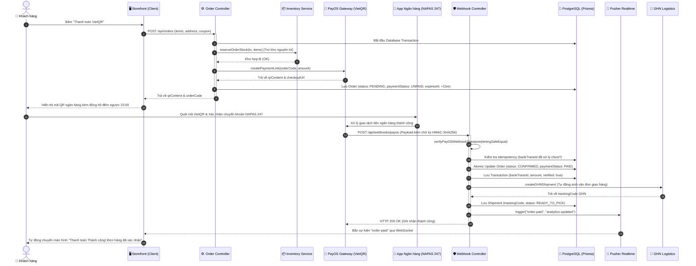

---

### UML 04: Sơ đồ Tuần tự 2: Nạp tiền Ví nội bộ qua VietQR

* **Phân loại UML:** `Sequence Diagram` (Hành vi)
* **Mục đích:** Quy trình khởi tạo phiên nạp tiền ví, quét mã QR VietQR PayOS và cộng tiền vào ví nguyên tử có đối soát Idempotent.
* **Cơ chế kỹ thuật:** Sinh mã giao dịch duy nhất có tiền tố `NAPVI`, kiểm tra trùng lặp qua `bankTransId` và tăng số dư ví bằng Atomic CAS Transaction kết hợp bắn Pusher cập nhật UI ngay lập tức.

#### Mã nguồn Mermaid:
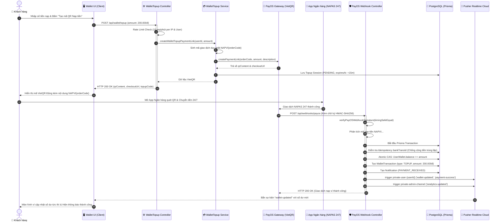

---

### UML 05: Sơ đồ Tuần tự 3: Hủy đơn & Hoàn tiền Ví CAS Nguyên tử

* **Phân loại UML:** `Sequence Diagram` (Hành vi)
* **Mục đích:** Quy trình hủy đơn hàng đã thanh toán với cơ chế Atomic CAS chống Double-Refund và tự động hoàn kho.
* **Cơ chế kỹ thuật:** Áp dụng điều kiện `updateMany where: {id, paymentStatus: PAID}, set {paymentStatus: REFUNDED}`. Nếu `updateResult.count !== 1` sẽ rollback ngay lập tức, ngăn ngừa triệt để lỗi đua lệnh hoàn tiền kép.

#### Mã nguồn Mermaid:
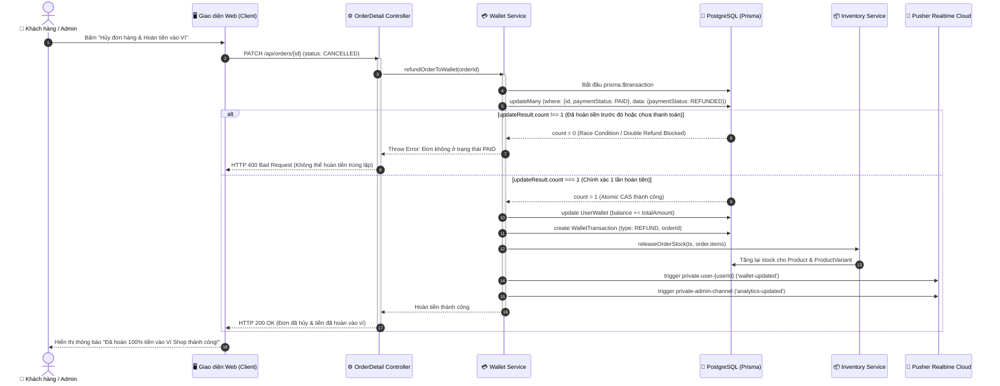

---

### UML 06: Sơ đồ Tuần tự 4: Chat Tư vấn Trực tuyến Real-time

* **Phân loại UML:** `Sequence Diagram` (Hành vi)
* **Mục đích:** Quy trình giao tiếp thời gian thực giữa Khách hàng và Quản trị viên/Nhân viên thông qua Pusher WebSockets.
* **Cơ chế kỹ thuật:** Xác thực kênh riêng tư (`private-chat-{roomId}`) qua API bảo mật, lưu trữ tin nhắn vào PostgreSQL, bắn event tức thời đến phòng chat và đồng bộ số tin chưa đọc.

#### Mã nguồn Mermaid:
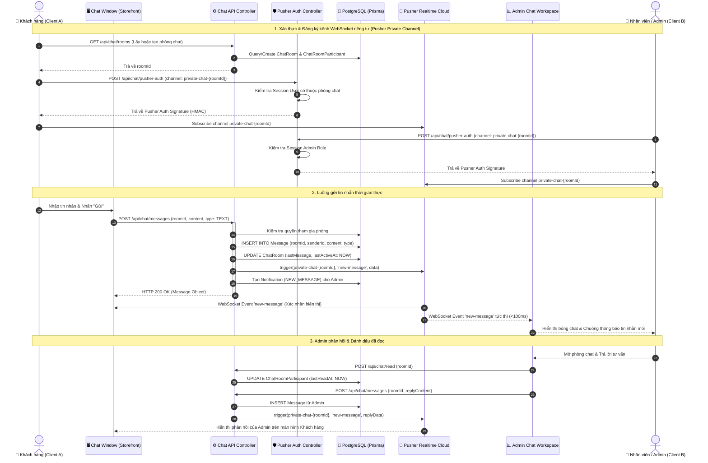

---

### UML 07: Sơ đồ Hoạt động 1: Quy trình Đặt hàng & Giữ kho Nguyên tử

* **Phân loại UML:** `Activity Diagram` (Hành vi)
* **Mục đích:** Quy trình kiểm tra tính hợp lệ, trừ kho nguyên tử (Atomic Inventory Reservation) và phân luồng thanh toán.
* **Cơ chế kỹ thuật:** Đảm bảo tính toàn vẹn kho hàng giữa Product tổng và từng Biến thể SKU trong một ACID Database Transaction duy nhất, phân luồng thanh toán linh hoạt VietQR / Ví nội bộ / COD.

#### Mã nguồn Mermaid:
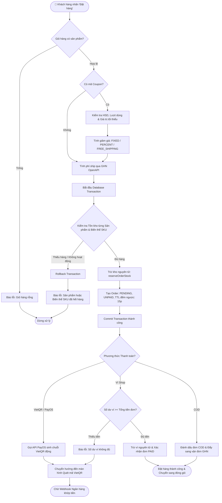

---

### UML 08: Sơ đồ Hoạt động 2: Bộ lọc An ninh & Đối soát Webhook Ngân hàng

* **Phân loại UML:** `Activity Diagram` (Hành vi)
* **Mục đích:** Quy trình xử lý bất biến an toàn (Fail-Closed, Timing-Safe HMAC, Idempotency) khi tiếp nhận dữ liệu ngân hàng.
* **Cơ chế kỹ thuật:** Lọc an ninh 4 lớp: 1. Fail-closed secret check; 2. Timing-safe HMAC-SHA256; 3. Regex parser phân loại đơn hàng DHxxxx và nạp ví NAPVIxxxx; 4. Idempotency check theo bankTransId chống replay attack.

#### Mã nguồn Mermaid:
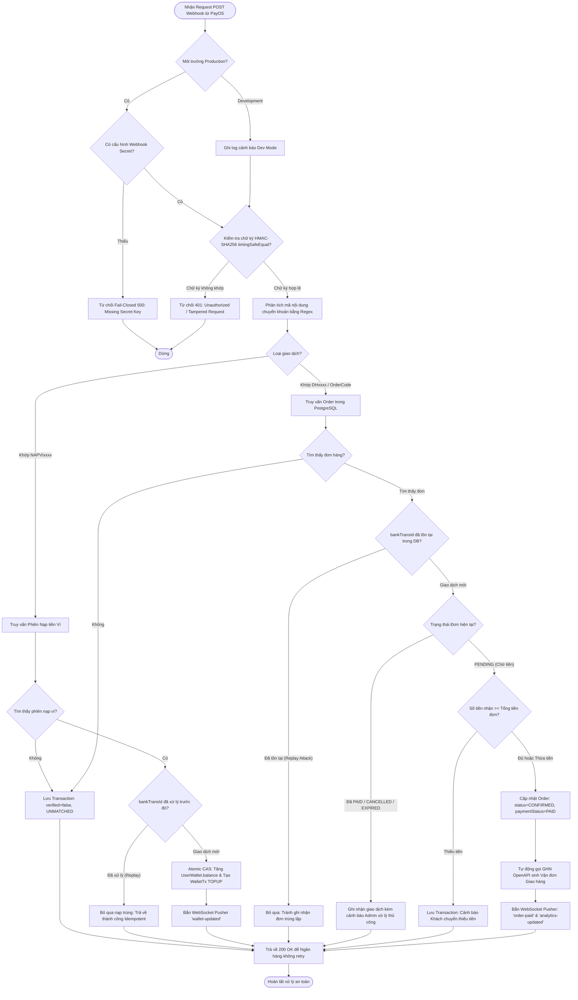

---

### UML 09: Sơ đồ Máy trạng thái 1: Vòng đời Đơn hàng & Quản lý Kho hàng

* **Phân loại UML:** `State Machine Diagram` (Hành vi)
* **Mục đích:** Cỗ máy hữu hạn trạng thái (Finite State Machine) quản lý tính nhất quán của Đơn hàng và Kho hàng.
* **Cơ chế kỹ thuật:** Quy định các bước chuyển trạng thái hợp lệ, đồng bộ giữa OrderStatus và PaymentStatus, cam kết giải phóng kho khi đơn bị hủy (CANCELLED) hoặc quá hạn (EXPIRED).

#### Mã nguồn Mermaid:
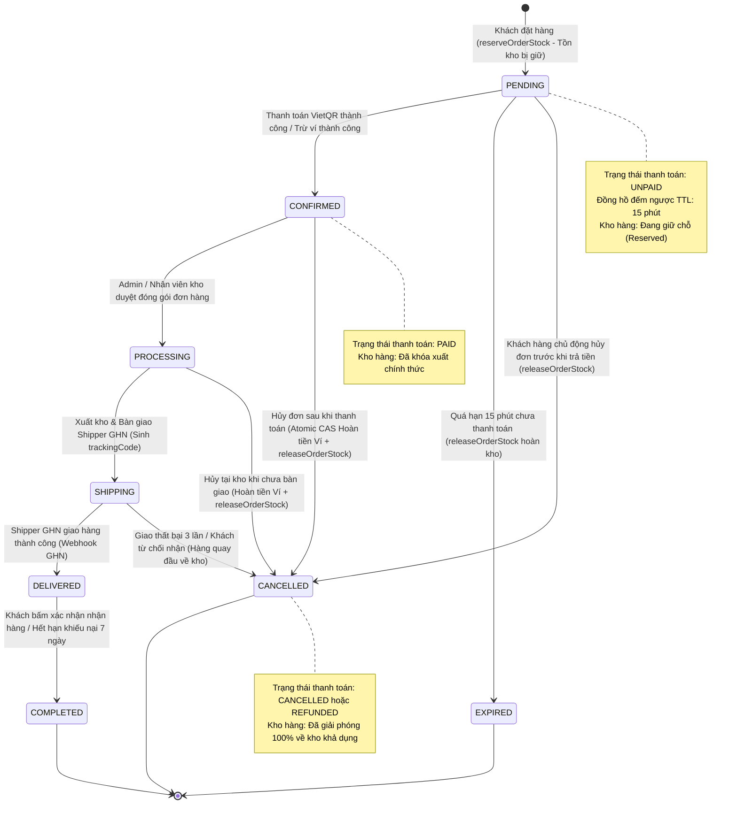

---

### UML 10: Sơ đồ Máy trạng thái 2: Vòng đời Vận đơn Giao Hàng Nhanh

* **Phân loại UML:** `State Machine Diagram` (Hành vi)
* **Mục đích:** Cỗ máy trạng thái vận chuyển (Logistics FSM) đồng bộ với Giao Hàng Nhanh qua OpenAPI và Webhook.
* **Cơ chế kỹ thuật:** Quản lý vòng đời kiện hàng từ lúc tạo phiếu READY_TO_PICK, shipper lấy hàng PICKING, trung chuyển DELIVERING, đến khi DELIVERED hoặc hoàn trả RETURNED.

#### Mã nguồn Mermaid:
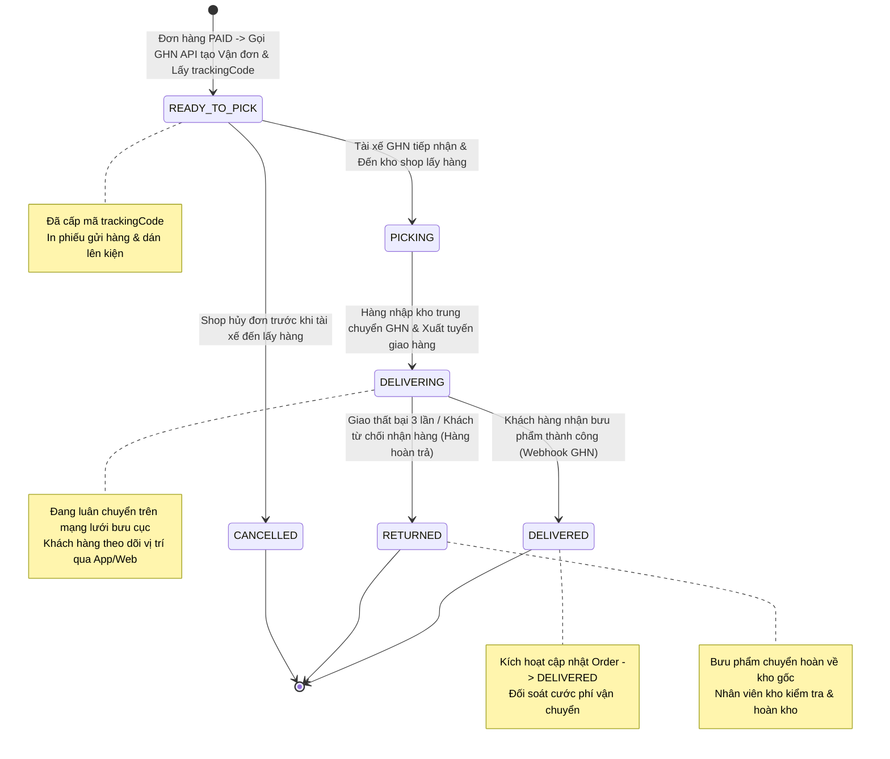

---

### UML 11: Sơ đồ Thành phần Kiến trúc Phần mềm (Clean Architecture)

* **Phân loại UML:** `Component Diagram` (Cấu trúc)
* **Mục đích:** Mô hình phân tầng kiến trúc nghiêm ngặt (@client, @server, @shared) bảo đảm Zero-Server-Leakage.
* **Cơ chế kỹ thuật:** Quy tắc phân tầng Clean Architecture: Tầng Presentation (@client) tuyệt đối không import mã nội bộ của @server, chỉ chia sẻ types và contracts qua @shared và giao tiếp qua HTTP REST APIs.

#### Mã nguồn Mermaid:
```mermaid
flowchart TB
    subgraph PresentationLayer ["🖥️ Tầng Trình diễn (Presentation Layer - @client)"]
        HomeView["HomeView (Hero 3D Parallax & Liquid Flow)"]
        ProductDetailView["ProductDetailView (Variant Selector & Reviews)"]
        CartView["CartView & CheckoutView (VietQR Modal)"]
        WalletView["WalletView (Top-up & Balance Tracker)"]
        WishlistView["WishlistView (Instant Sync)"]
        ChatWindow["ChatWindow & MessageBubble"]
        AdminDashboard["AdminDashboardView (Bento Grid KPIs)"]
        AdminOrders["AdminOrders & Reconcile Views"]
        AdminChat["AdminChatView (Realtime Support)"]
        ZustandStores["Zustand Client Stores (Cart, Wishlist)"]
        PusherClient["Pusher JS WebSocket Client"]
    end

    subgraph ApplicationLayer ["⚙️ Tầng Ứng dụng & Dịch vụ (Application Layer - @server)"]
        OrderRoutes["Order & Checkout Route Handlers"]
        WebhookRoutes["PayOS & GHN Webhook Handlers"]
        WalletRoutes["Wallet Topup & Payment Controllers"]
        ChatRoutes["Chat Messages & Pusher Auth Handlers"]
        AdminRoutes["Analytics, Reconcile & Products Handlers"]
        
        WalletService["WalletService (Atomic CAS Refund & Pay)"]
        WalletTopupService["WalletTopupService (VietQR Idempotency)"]
        InventoryService["InventoryService (Atomic Reservation & Release)"]
        OrderFSM["OrderFSM Engine (State Invariant Guard)"]
        PayOSService["PayOSService (HMAC Gateway & Parsing)"]
        GHNService["GHNService (Logistics OpenAPI & Fee Calc)"]
        ChatService["ChatService (Pusher Realtime Orchestration)"]
    end

    subgraph SharedLayer ["📦 Tầng Dùng chung An toàn (Shared Kernel - @shared)"]
        SharedTypes["DTO Types & API Contract Interfaces"]
        SharedEnums["Domain Enums (OrderStatus, Role, etc.)"]
        SharedValidators["Zod Validation Schemas"]
        SharedErrors["AppError, ValidationError, AuthError"]
        SharedUtils["Formatters, Crypto Utils & Date Helpers"]
    end

    subgraph InfrastructureLayer ["🗄️ Tầng Hạ tầng & Dịch vụ Đám mây (Infrastructure Tier)"]
        PostgresDB[("🐘 PostgreSQL (Prisma ORM with Connection Pool)")]
        RedisCache[("⚡ Upstash Serverless Redis (Cache & Rate Limiting)")]
        PusherCloud["📡 Pusher Channels (WebSocket Realtime Cloud)"]
        PayOSGateway["🏦 PayOS Gateway (VietQR & NAPAS 247)"]
        GHNCloud["🚚 GHN Logistics OpenAPI Server"]
        ResendEmail["✉️ Resend Cloud API (OTP & Password Reset)"]
        CloudinaryCDN["🖼️ Cloudinary CDN (Image Optimization)"]
    end

    %% Dependencies
    PresentationLayer --> SharedLayer
    ApplicationLayer --> SharedLayer
    PresentationLayer -->|Fetch JSON REST APIs| ApplicationLayer
    PresentationLayer -.->|❌ NGHIÊM CẤM IMPORT TRỰC TIẾP (Zero-Leakage)| ApplicationLayer

    ApplicationLayer --> PostgresDB
    ApplicationLayer --> RedisCache
    ApplicationLayer --> PusherCloud
    ApplicationLayer --> PayOSGateway
    ApplicationLayer --> GHNCloud
    ApplicationLayer --> ResendEmail
    ApplicationLayer --> CloudinaryCDN
```

---

### UML 12: Sơ đồ Triển khai Hạ tầng Hệ thống (Deployment Architecture)

* **Phân loại UML:** `Deployment Diagram` (Cấu trúc)
* **Mục đích:** Kiến trúc triển khai phân tán trên nền tảng Serverless, Managed Database và các Micro-SaaS API.
* **Cơ chế kỹ thuật:** Hạ tầng triển khai 5 tầng: Client Tier -> Edge Tier (Cloudflare/Vercel) -> Compute Tier (Next.js 16 Serverless) -> Data Persistence Tier (Neon Postgres + Upstash Redis) -> External SaaS Tier.

#### Mã nguồn Mermaid:
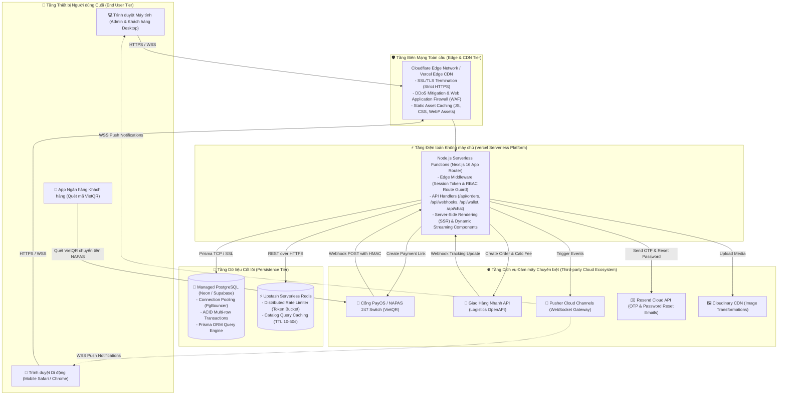

---

### UML 13: Sơ đồ Gói & Cấu trúc Mô-đun (Package Diagram)

* **Phân loại UML:** `Package Diagram` (Cấu trúc)
* **Mục đích:** Cấu trúc các gói mã nguồn, quy ước phân vùng trách nhiệm và ranh giới mô-đun trong dự án.
* **Cơ chế kỹ thuật:** Kiểm soát tính độc lập của từng package, tách rời hoàn toàn Presentation (@client), Domain (@server) và Kernel (@shared), đi kèm 250+ unit/integration tests bảo vệ kiến trúc.

#### Mã nguồn Mermaid:
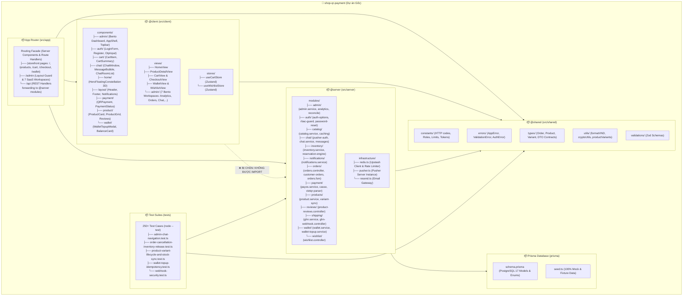
